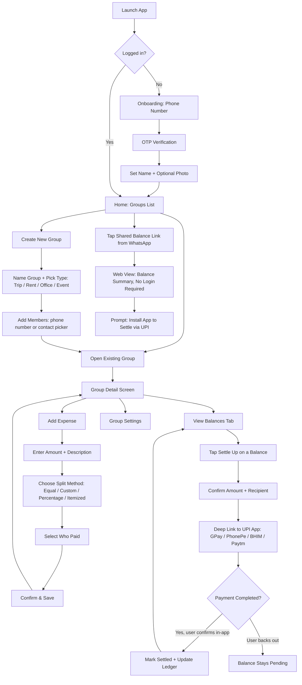

# TicketSplit — User Flow & Build Guide

*For developers / vibe-coders building the MVP. This is the flow spec — build screens in this order, and don't add anything not listed here for v1.*

---

## 1. Overall App Flow

---

## 2. Screen-by-Screen Spec

Build these 9 screens for v1. Nothing else.

### 2.1 Splash / Launch
- **Purpose:** Check auth state, route to onboarding or home.
- **Logic:** If a valid session token exists locally, skip straight to Home. No UI decisions needed here beyond a logo/loading state.

### 2.2 Onboarding — Phone Number
- **Elements:** Country code (default +91), phone number input, "Send OTP" button.
- **Validation:** 10-digit Indian number required. Disable button until valid.
- **Edge case:** Number already registered → proceed to OTP as normal (this is also the login flow, not just signup).

### 2.3 OTP Verification
- **Elements:** 6-digit OTP input (auto-read from SMS if permission granted), "Resend OTP" (disabled for 30s), "Verify" button.
- **Edge case:** Wrong OTP → inline error, allow retry up to 5 times before forcing a fresh "Send OTP."

### 2.4 Set Name + Photo (first-time users only)
- **Elements:** Name field (required), profile photo (optional, skip allowed).
- **Note:** This is the only profile setup step in v1 — no email, no extra fields.

### 2.5 Home — Groups List
- **Elements:** List of groups (name, group type icon, your current balance in that group shown as "you owe ₹X" / "you're owed ₹X" / "settled"), floating "+" button to create a group.
- **Empty state:** If no groups yet, show a single CTA: "Create your first group."
- **Edge case:** Sort groups by most recently active, not alphabetically — recency matters more than name here.

### 2.6 Create New Group
- **Elements:** Group name input, group type selector (Trip / Rent-Flatshare / Office / Event — this selection changes which affiliate category gets tagged later, so it's a **required** field, not cosmetic).
- **Add members:** Phone contact picker or manual number entry. No minimum, but warn if only 1 member added ("A group needs at least one other person").
- **Edge case:** Inviting a number that isn't on the app yet → they still get added to the group's balance ledger and receive an SMS/WhatsApp invite link; they don't need the app to be tracked, only to pay via the shared link (see 2.9).

### 2.7 Group Detail Screen
- **Tabs:** "Expenses" (default) and "Balances."
- **Expenses tab:** Chronological list of all expenses in the group, each showing amount, description, who paid, and date.
- **Balances tab:** Net balance per member ("Rahul owes you ₹450," "You owe Priya ₹200"), with a "Settle Up" button next to each.
- **Floating action:** "Add Expense" button, always visible.

### 2.8 Add Expense
- **Step 1:** Amount + description (required fields, description can be freeform or a quick-pick chip: Food / Rent / Travel / Utilities / Other — the chip choice also feeds the affiliate-targeting category).
- **Step 2:** Split method — four options as tabs, not a dropdown (dropdowns get missed by users in testing on this kind of screen):
  - **Equal** — auto-splits across all group members, default selected.
  - **Custom amounts** — manual entry per person, must sum to total or show a validation error.
  - **Percentage** — per person, must sum to 100%.
  - **Itemized (v1.1, not MVP)** — skip this for the first build; flag it as a stub button that says "Coming soon."
- **Step 3:** "Paid by" — defaults to the current user, but can be reassigned to any group member (handles the case where someone else fronted the money).
- **Step 4:** Save → returns to Group Detail, new expense appears at top of list, balances recalculate immediately.

### 2.9 Settle Up
- **Trigger:** Tapping "Settle Up" next to a balance in the Balances tab.
- **Step 1:** Confirmation screen shows exact amount and recipient, with a note: "This will open your UPI app to complete payment."
- **Step 2:** Tapping "Pay Now" fires a UPI deep link/intent (`upi://pay?...`) with the amount and recipient's UPI ID pre-filled. This hands off to whichever UPI app is installed (GPay, PhonePe, BHIM, Paytm) — **TicketSplit never touches the money itself.**
- **Step 3:** On return to TicketSplit, show a simple prompt: "Did the payment go through?" with Yes/No — since the app has no way to auto-verify a UPI transfer initiated in another app. Yes → mark settled and update ledger. No → balance stays pending, no error shown (payment may have failed or been cancelled deliberately).
- **Edge case — no UPI ID for a member:** If a group member hasn't linked a UPI ID (only phone-added, no account), fall back to sharing a plain UPI payment link/QR instead of a deep link.

### 2.10 Shared Balance Link (non-app web view)
- **Purpose:** Anyone added to a group — even without installing the app — can open a link (sent via WhatsApp/SMS) and see what they owe.
- **Elements:** Read-only balance summary, a "Pay via UPI" button (same deep-link behavior as 2.9), and a soft CTA to install the app.
- **Important:** No login required for this view — it's keyed to a unique, unguessable link token per person, not a password.

---

## 3. Two Flows Worth Walking Through End-to-End

### Flow A — Flatmates set up recurring rent
1. User creates a group, selects type "Rent — Flatshare," adds 2 flatmates by phone number.
2. Adds an expense: ₹18,000 "October Rent," equal split, paid by self.
3. Balances tab shows each flatmate owes ₹6,000.
4. Each flatmate gets a WhatsApp notification with the shared balance link.
5. One flatmate taps "Settle Up" → deep-links to their GPay → pays → returns → confirms "Yes" → balance clears.
6. Next month, the app resurfaces the same group with a reminder nudge to log the new month's rent (this is a v1.1 automation — for MVP, it's a manual repeat of steps 2-5, just with the group already set up).

### Flow B — Trip group, one-off settle-up
1. Group "Goa Trip" already exists with 4 members.
2. User adds an expense: ₹4,000 "Hotel," paid by self, split equally.
3. Balances update: each of the other 3 owes ₹1,000.
4. A native suggestion card appears on the group screen (flights/hotel booking offer) — this is the monetization surface, and it must **never** appear on the Add Expense screen itself, only on Group Detail or post-settlement.
5. Members settle up individually via their own UPI app.

---

## 4. Data Model (minimum viable)

| Entity | Key fields |
|---|---|
| **User** | id, phone_number, name, photo_url, upi_id (optional) |
| **Group** | id, name, type (trip/rent/office/event), created_by, created_at |
| **GroupMember** | group_id, user_id (nullable if phone-only, not yet on app), phone_number |
| **Expense** | id, group_id, amount, description, category_tag, paid_by, created_at |
| **Split** | expense_id, group_member_id, amount_owed |
| **Settlement** | id, group_id, from_member, to_member, amount, status (pending/completed), settled_at |

This is enough to build all 9 screens above. Don't over-engineer the schema before the MVP is validated.

---

## 5. Edge Cases Checklist (don't skip these — this is where "vibe coded" builds usually break)

- [ ] What happens when someone is removed from a group with a non-zero balance? (Recommendation: block removal until settled, or archive with balance frozen.)
- [ ] Two people add expenses at the same time — balances must recalculate from the full expense list, not from a cached running total, to avoid race conditions.
- [ ] Currency is always INR — don't build multi-currency support for v1, it adds UI complexity nobody asked for yet.
- [ ] A group member with no phone/app access (added by name only) — allowed for record-keeping, but they can't receive a settle-up link. Flag this clearly in the UI rather than failing silently.
- [ ] Negative amounts / zero-amount expenses — block at input validation, not after save.
- [ ] Deep link fails because no UPI app is installed — fall back to showing a UPI ID + amount for manual copy-paste, don't just error out.

---

## 6. Build Order (if you're vibe-coding this solo)

1. Auth (2.2–2.4) — get login working end to end first, including OTP.
2. Home + Create Group (2.5–2.6) — static list, no expenses yet.
3. Add Expense + Group Detail (2.7–2.8) — the core value loop. Get equal-split working before touching custom/percentage.
4. Balances calculation — this is pure logic, test it with unit tests before wiring up any UI, since every screen depends on it being correct.
5. Settle Up deep link (2.9) — UPI intent handling, test on a real device (emulators won't have UPI apps installed).
6. Shared Balance Link (2.10) — the one screen that runs outside the authenticated app, build it as a separate lightweight web view.
7. Everything else (recurring reminders, OCR, affiliate cards) is v1.1+ — do not build it before steps 1-6 work end to end with a real group of real friends.
